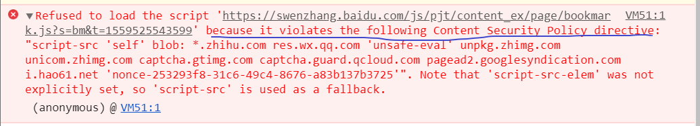
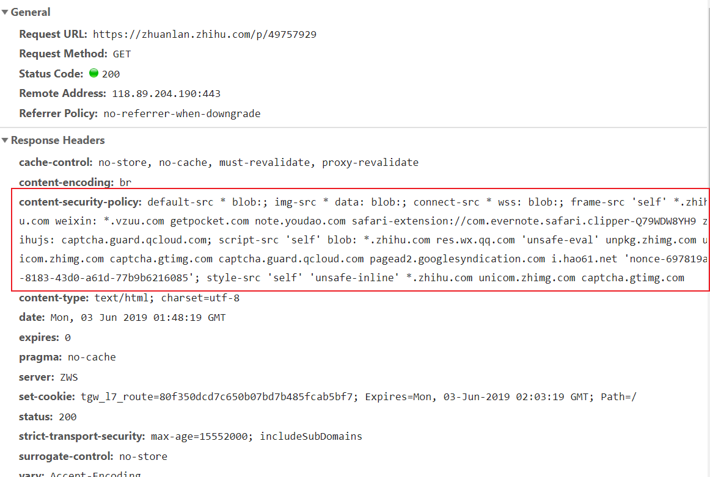

个人经常使用使用[百度云收藏工具](https://wenzhang.baidu.com/tools)，收藏一些好的文章或图片。但是在收藏**知乎专栏文章**的时候，点击**收藏**

打开`devtools`,发现控制台报错。


经搜索`Content Security Policy`，发现其`CSP(内容安全策略 )`，是一种额外的手段，主要用于检测并削弱某些特定类型的攻击，包括跨站脚本 (XSS) 和数据注入攻击等。

>CSP 的实质就是白名单制度，开发者明确告诉客户端，哪些外部资源可以加载和执行，等同于提供白名单。它的实现和执行全部由浏览器完成，开发者只需提供配置。

有2种方式启用CSP
- 通过HTTP头信息的 `Content-Security-Policy`字段
- 通过网页的`meta`标签

```html
<meta http-equiv="Content-Security-Policy" content="script-src 'self'; object-src 'none'; style-src cdn.example.org third-party.org; child-src https:">
```
排查知乎文章的网页和http请求，果然发现，其在Http 头信息中配置了`CSP`


可以看到上面对注入的脚本做了限制
```
script-src 'self' blob: *.zhihu.com res.wx.qq.com 'unsafe-eval' unpkg.zhimg.com unicom.zhimg.com captcha.gtimg.com captcha.guard.qcloud.com pagead2.googlesyndication.com i.hao61.net 'nonce-697819ab-8183-43d0-a61d-77b9b6216085';
```
只允许从上述域名或带签名的标签加载或执行脚本

而百度云收藏工具注入的脚本不在范围内，所以脚本不执行

## 如何忽略内容安全策略
参考：https://github.com/PhilGrayson/chrome-csp-disable/blob/master/background.js#L9

原理是，拦截http请求，处理 csp 头信息。

当然可以添加白名单网站，判断哪些网站要忽略csp设置。


## 参考资料
[mdn 内容安全策略](https://developer.mozilla.org/zh-CN/docs/Web/HTTP/CSP)

[csp 手册](https://content-security-policy.com/)

[阮一峰-CSP](http://www.ruanyifeng.com/blog/2016/09/csp.html)