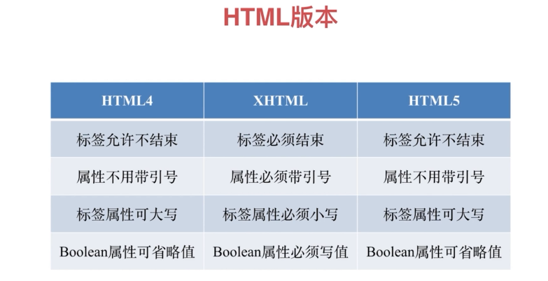

## 常见 html 标签 及分类

参考：https://developer.mozilla.org/zh-CN/docs/Web/HTML/Element

- html

  - head
    - title
    - meta 定义一些 元数据 用来描述 文档 ，详细使用参考 [meta](https://developer.mozilla.org/zh-CN/docs/Web/HTML/Element/meta)
    - base
    - link
    - script
    - style
  - body

    - div /section/ article / aside / header /footer

      主要用来布局，但是 `div` 表意不明，没有语义

    - p 段落
    - span / em / strong
    - table / thead/ tbody / tr/ td 表格
    - ul/ ol/ li 无序/有序 列表
    - dl dt dd 定义列表
    - a 链接
    - form / input / select / textarea / button / label/ select 表单元素

一些常用 html 标签讲解

### [meta](https://developer.mozilla.org/zh-CN/docs/Web/HTML/Element/meta)
 `<meta charset="UTF-8">`

用来设置文档编码

 `<meta name="viewport" content="width=device-width, initial-scale=1.0,user-scalable=no">`

主要用来适配移动端

### [a 标签](https://developer.mozilla.org/zh-CN/docs/Web/HTML/Element/a)

**a** 标签的 `target` 属性主要用来，规定在何处打开链接文档。

| 值        | 描述                                                                                                 |
| --------- | ---------------------------------------------------------------------------------------------------- |
| \_blank   | 在新窗口中打开被链接文档。                                                                           |
| \_self    | 默认。在相同的框架中打开被链接文档。                                                                 |
| \_parent  | 在父框架集中打开被链接文档。                                                                         |
| \_top     | 在整个窗口中打开被链接文档。                                                                         |
| framename | 在指定的框架或窗口中打开被链接文档，如果窗口不存在，则新建窗口。否则在指定窗口重新加载href指定的文档 |

关于a标签 target 的示例 参考： http://www.w3school.com.cn/tags/att_a_target.asp

### [Form表单](https://developer.mozilla.org/zh-CN/docs/Web/HTML/Element/form)

- 如果是ajax请求提交数据，还需要使用form来设置表单吗？  
  理论上不需要，但是使用form会
  - 可以利用form 里面的reset 功能
  - form 提供了 FormData 可以获取整个表单数据 

- property 与 attribute 的区别？
  -  attribute 是 死的
  -  property 是 活的

## html 文档结构

使用 http://h5o.github.io 查看 网页大纲

良好的文档大纲，便于爬虫，机器了解网页结构

## html 版本



html5 增加的内容，主要是语义化

- 新区块标签 
  - header / footer 头尾
  - section / article 区域
  - nav 导航
  - aside 侧边栏 不重要的内容
- 表单增强
  - 日期 时间 搜索
  - 表单验证
  - placeholder 自动聚焦
- em (斜体)/ strong(粗体) 强调
- i icon 

- 新的api (离线、音视频、图形、实时通信、本地存储、设备能力)


## html 标签分类

- 按默认样式分类
  - 块级元素 block
  - 行内 inline
  - inline-block

- 按内容 分类
## html 默认样式

相同的html 元素，在不同浏览器上显示表现差异，为使其显示一致，需要去掉默认样式或使其样式一致，因此需要 **reset css**

主要做的是：
- 有的默认css 不想要，就去掉
- 有的样式不同浏览器不一样，使其表现一致
等于说样式归0

最简单的方式是
```css
* {
  margin: 0;
  padding: 0;
}
```
或 参考 https://meyerweb.com/eric/tools/css/reset/

另一种方案是 [normalize.css](https://necolas.github.io/normalize.css/)

与reset css 的差异

- 保留有用的浏览器默认值而不是删除它们
- 规范各种HTML元素的样式
- 等等